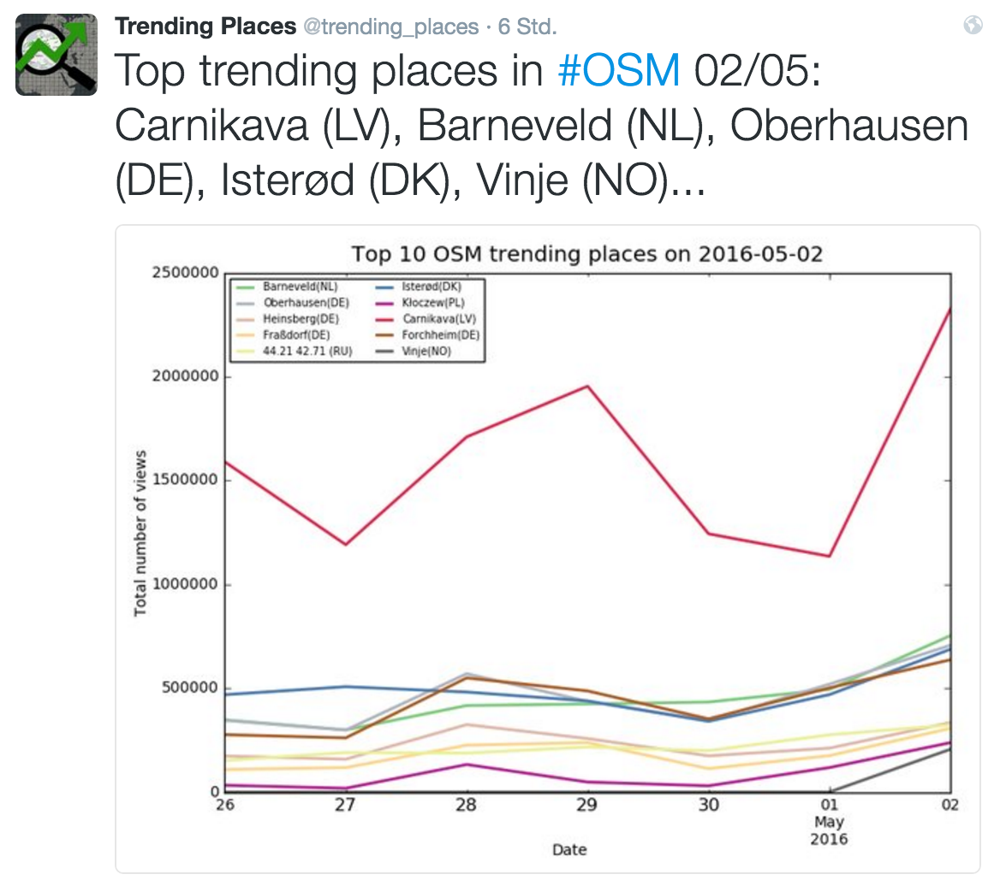

# map-trends

This was a collection of hacky scripts to analyze [OpenStreetMap](https://openstreetmap.org) for map trends.

Please **[check out the great successor project](https://github.com/geometalab/Trending-Places-in-OpenStreetMap)** from [Bhavya Chandra](https://github.com/BhavyaLight)  who [built a 
Twitter bot](https://twitter.com/trending_places) that tweets the trending places on OpenStreetMap.

